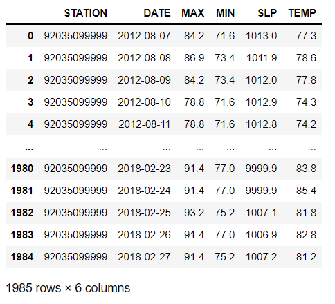

# MarsToday: evaluating Mars climate through REMS sensor onboard Curiosity Mars rover


A Mars rover is a motor vehicle designed to travel on the surface of Mars. Rovers have several advantages over stationary landers: they examine more territory, they can be directed to interesting features, they can place themselves in sunny positions to weather winter months, and they can advance the knowledge of how to perform very remote robotic vehicle control.

Curiosity landed in the crater Gale on planet Mars. The landing site coordinates are: 4.5895°S 137.4417°E. The location was named Bradbury Landing on 22 August 2012, in honor of science fiction author Ray Bradbury. Gale, an estimated 3.5 to 3.8 billion-year-old impact crater, is hypothesized to have first been gradually filled in by sediments; first water-deposited, and then wind-deposited, possibly until it was completely covered.


Curiosity has a lot of instruments onboard. One of them, REMS (Rover Environmental Monitoring Station) measures and provides daily and seasonal reports on atmospheric pressure, humidity, ultraviolet radiation at the Martian surface, air temperature, and ground temperature around the rover. REMS was develeoped in Spain by the Centro de Astrobología (CAB/CSIC-INTA) in collaboration with NASA and JPL-Caltech.


REMS installation. Credit NASA/JPL-Caltech/CAB

The data contained in this project represents the weather conditions on Mars from Sol 1 (August 7, 2012 on Earth) to Sol 1895 (February 27, 2018 on Earth). Sol is equivalent to 1 Martian day (1 Martian day = 24h 40 min).

However, REMS does not take measurements continuously and it takes measurements at different times from one day to another. For different reasons (instrument maintenance, instrument calibration, instrument degradation, etc.), some or all of the magnitudes in this project were not be available.

# 1. Objective

The main questions I considered are the following:

- How is the weather on Mars?
- How it compares to its twin location on Earth?
- Is it possible to predict the weather with the missing data?
- BONUS: can I obtain pictures from Mars and complement the data?

# 2. Data acquisition

The base data was extracted from Kaggle, "Mars weather data" by Kannan.K.R. Source: https://www.kaggle.com/datasets/imkrkannan/mars-weather-data

The data was complemented with weather data from Papua New Guinea (twin location of Curiosity on Earth) available on NOAA Global Surface Summary of the Day services, in the same range of dates as provided by Kannan.K.R. Source: https://www.ncei.noaa.gov/access/search/data-search/global-summary-of-the-day

Data prediction and current weather information were extracted using Selenium from the CAB-CSIC/INTA webpage. Source: http://cab.inta-csic.es/rems//

# 3. File contents

- src/ --> Contains the executable python files of the cleaning and visualization process. 
- images/ --> All the necessary pictures data/ --> Contains an edited version of the original dataframe 
- README --> What you are reading right now.

# 4. Function definitions

The first step was to define all the necessary functions to clean my datasets. For example, a function to remove columns would be:

```python

def remove_columns(df, column_name):
    
    """
    This is a function that removes undesired columns. Requires two arguments.
    Arguments: dataframe, column name
    Input: the current dataframe
    Output: the current dataframe without the selected columns
    """
    
    df.drop(columns=f"{column_name}", inplace=True)
    
    return df.sample(2)

```
However, the most important functions are those needed to extract information from the NASA API (exaplained later). These functions are:

```python
def call_Curiosity (date, camera):
    """
    This is a function that calls NASA API 'Mars Rover Photos' with two arguments. It returns the url from
    a specific camera onboard Curiosity rover.
    date: input the desired date in the format YYYY-MM-DD as a STRING,
    camera: select between FHAZ, RHAZ, MAST, CHEMCAM, MAHLI, MARDI, NAVCAM, PANCAM, MINITES, as STRING
    
    """
        
    try:
        nasa = os.getenv("token")
        url = f"https://api.nasa.gov/mars-photos/api/v1/rovers/curiosity/photos?earth_date={date}&camera={camera}&api_key={nasa}"
        request = requests.get(url)
        df = pd.DataFrame(request.json())
        df_clean = pd.DataFrame(df.values[0][0])
        image_url = list(df_clean["img_src"])[0]
        display(Image(image_url, width=300, height=200))
        
        return f"Image available for camera {camera} onboard Curiosity rover"

    except:
            
        return f"No image available on {date} for camera {camera} onboard Curiosity rover, please select another date"
```
```python

def get_pictures_Curiosity(date):
    
    """
    This is a function that calls call_NASA function with one argument. It returns the url of all the pictures 
    taken by all the cameras of Curiosity rover from a specific Sol date.
    date: input the desired date in the format YYYY-MM-DD as STRING.
    
    """       
    cameralist = ["FHAZ", "RHAZ", "MAST", "CHEMCAM", "MAHLI", "MARDI", "NAVCAM", "PANCAM", "MINITES"]
    for i in cameralist:
        print(call_Curiosity(date, i))
    pass
```

The objetive is to extract pictures from Mars givena determinate date.

# 5. Data wrangling and cleaning

The second step was to actually clean the databases:

- Kaggle database: <br/>
    In the beginning the dataframe looked like this:

     <br/>
    With a total shape of 1894 rows x 10 columns. The table contained unnecessary columns and a lot of NaNs. In addition, column titles could be more readable and I also wanted to include more information in the form of new columns. <br/>
    The cleaning steps were the following:
<br/>
    - Remove undesired columns: used "columns_to_remove" custom function
    - Created a new column: "Mean_temp"
    - Cleaned the atmosphere column: used "clean_atmosphere" custom function
    - Renamed column names: used "rename_columns" custom function
    - Cleaned the month column: used "clean_month" custom function
    - Created a new column: "Season", by importing Month values <br/><br/>
     
    Data cleaned: <br/>
<br/><br/>

- NOAA database:<br/>
    In the beginning the dataframe looked like this:

    <br/>

    The cleaning steps were the following:
<br/>
    - Remove undesired columns: used "columns_to_remove" custom function
    - Renamed column names: used "rename_columns" custom function
    - Converted temperatures values from Fahrenheit to Celsius: used "FtoC" custom function
    - Converted from mBar to Pascals: used "mbartoPa" custom function
    - Remove 99999s from Pressure column
    - Rounded values of the mean_temp column

    Data cleaned:
    

# 6. Web Scrapping

Both dataset had to be complemented with additional information taken directly from webpages.

This information is crucial for the last phase of the project, "Mars Today", in order to predict the weather of Mars beyond the limit date of the Kaggle dataframe.

The scrapping was performed on the REMS widget from the CAB-REMS webpage, http://cab.inta-csic.es/rems/es/ using Selenium.

## 6.1 Cleaning the database

Similar operations were performed with the database originated.


And the final database:


# 7. Data visualization and data analysis

At this point, one might think why was import to extract data from NOAA. The data itself from Mars doesn't give many information unless it's compared with the conditions on Earth.

Thus, the coordinates from the Gale crater were extrapolated on Earth. The twin location on our planet is next to Papua New Guinea (5º south from the equator)


Info about temperature and pressure were related an visualized using Plotly.


## 7.1 Temperature profiles

Please remember, the third planet from the Sun have a very thin atmosphere, approximately 100 times less dense than ours. This fact has direct implications on the surface temperature: without magnetic field or atmosphere to thermoregulate and distribute heat, the planet has to deal of temperatures from -30 ºC to -60 ºC. Meanwhile on Earth, the range of temperatures is much warmer and less prominent as on Mars.

Take also a closer look to the subtle shift from Papua New Guinea. Since 2016, the temperature baseline has been displaced upwards! Could be an indicative of an anomaly, such as climate change. On the other hand, the temperature pattern on Mars remains constant, with very little deviations from one year to another. This can give us the key to predict future values beyond 2018.

## 7.2 Pressure profiles

It is impossible to not realize the weird pattern on Mars, which has no common points with Earth's. Why so?

According to J.A.Rodríguez-Manfredi et al. on their paper published on JGR Planets, "Mars Surface Pressure Oscillations as Precursors of Large Dust Storms Reaching Gale" (DOI: https://doi.org/10.1029/2021JE007005), Martian dust storms strongly interfere with global circulation patterns and change the diurnal and semidiurnal pressure variability as well as oscillations with periods greater than one sol associated with planetary waves. The specific pressure oscillations preceding each storm period are likely to be signatures of the large-scale circulation patterns that enable the growth and propagation of the storm fronts.

Another paper from N. Rennó et al., titled "Pressure observations by the Curiosity rover: Initial results" (DOI: https://doi.org/10.1002/2013JE004423) suggest that it is possible to witness atmospheric features at various spatial and temporal scales, e.g., the gradually increasing pressure due to the advancing Martian season, diurnal tides, thermal vortices, and other local atmospheric phenomena. 
# Links and Resources:

- https://agupubs.onlinelibrary.wiley.com/doi/10.1029/2021JE007005
- https://agupubs.onlinelibrary.wiley.com/doi/full/10.1002/2013JE004423